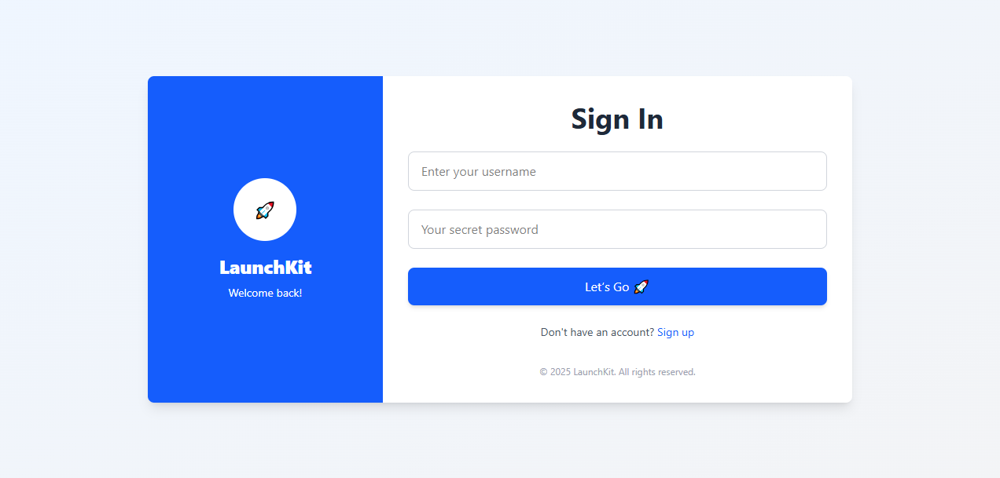
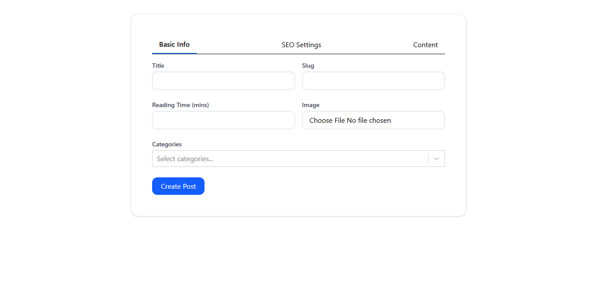
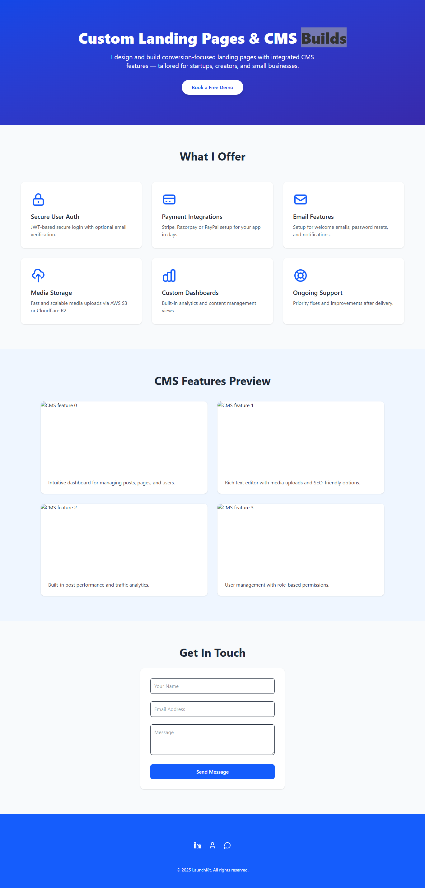
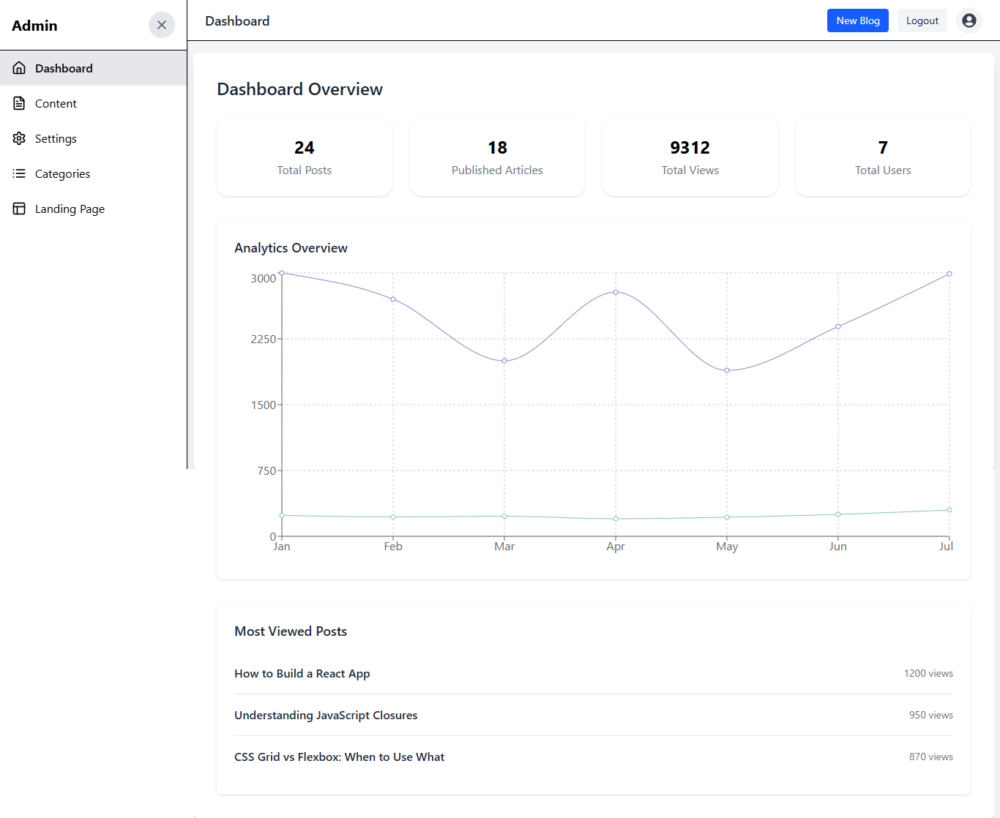
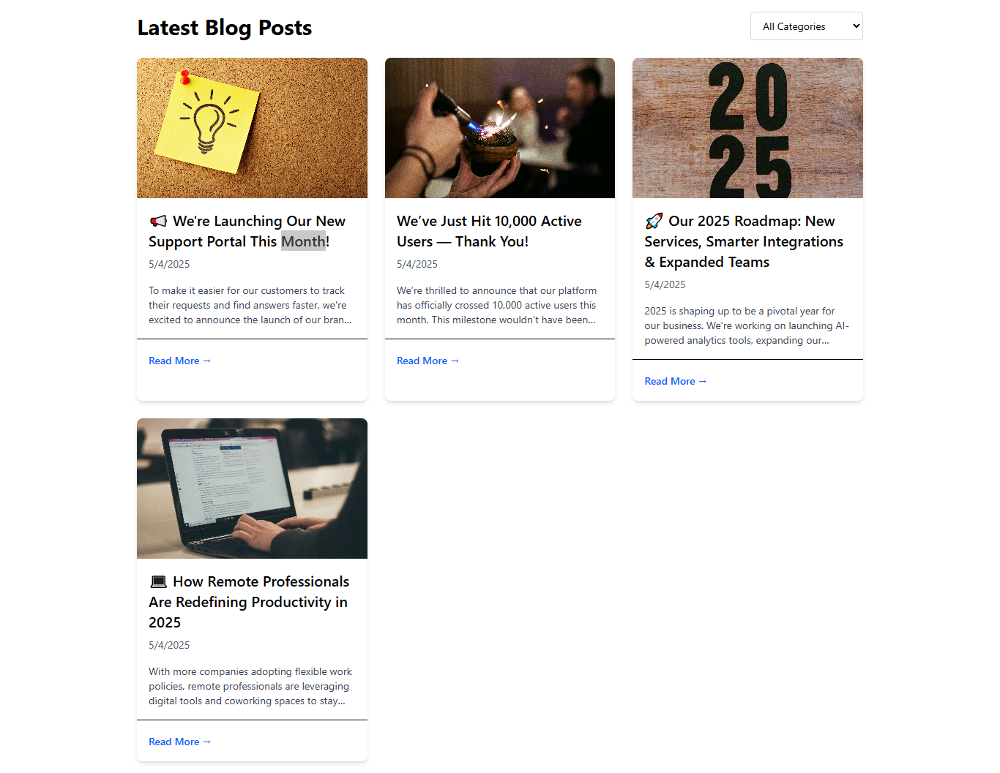
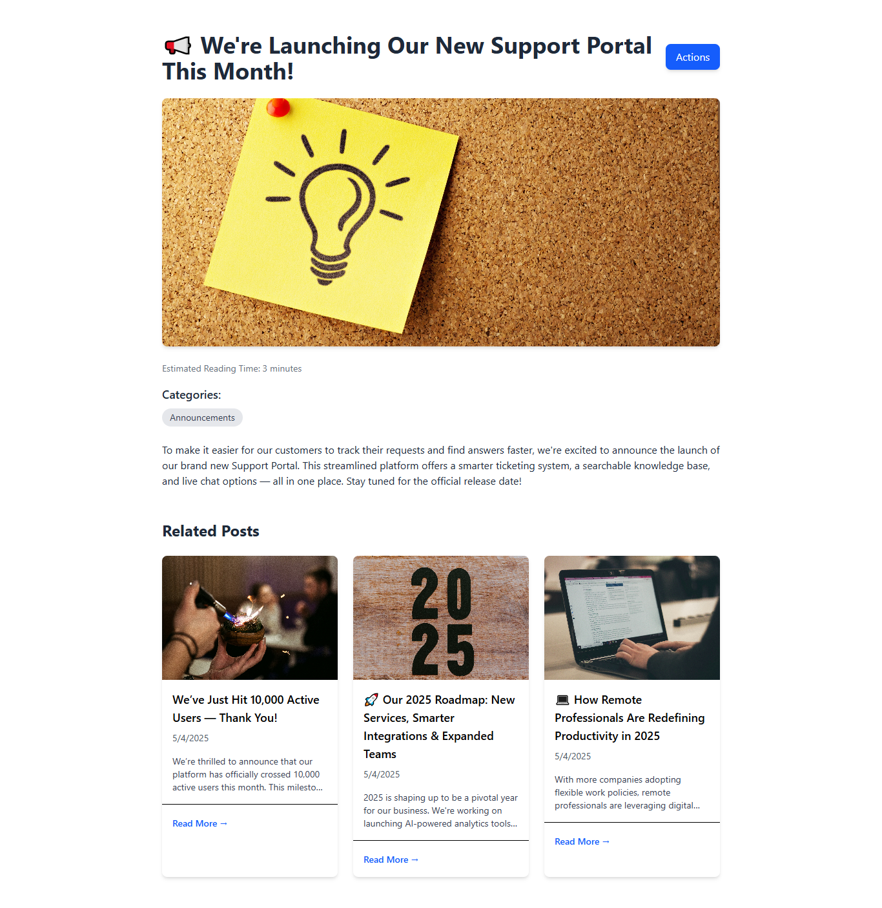

#CMS Blog & Landing Page Application

A full-stack content management and blogging platform with a marketing landing page, built using Django REST Framework and React (Vite). This project is designed for small businesses, personal portfolios, or SaaS products that need a simple, customizable content-driven site with basic user authentication and post management.

##Features

Landing Page: Public-facing marketing page with hero section, feature highlights, and call-to-action.

User Authentication: Secure login and registration using JWT.

##Blog Management:

Create, edit, and delete blog posts (authenticated users)

Public blog list and individual blog post pages

CMS Dashboard: Accessible for authenticated users to manage content.

##Core Pages & Screenshots

###Login Page

Simple, clean login interface for registered users.

###Blog Create Page

Authenticated users can draft and publish new blog posts with title, image, and rich text content.

###Landing Page

Public marketing landing page featuring hero section, service highlights, and latest blog previews.

###Analysis Dashboard

Displays site-wide stats like total posts, views, user registrations, and most viewed blog posts.

###Blog List Page

Displays a list of published blog posts with titles, excerpts, and links to full articles.

###Single Blog Page

Displays a full blog post including title, image, content, and publication date.

##Notes
This project focuses on clean, modular code and separation of concerns between frontend and backend. It’s intended as a learning and demo platform, not a production-grade product — though it can be adapted as a foundation for client projects